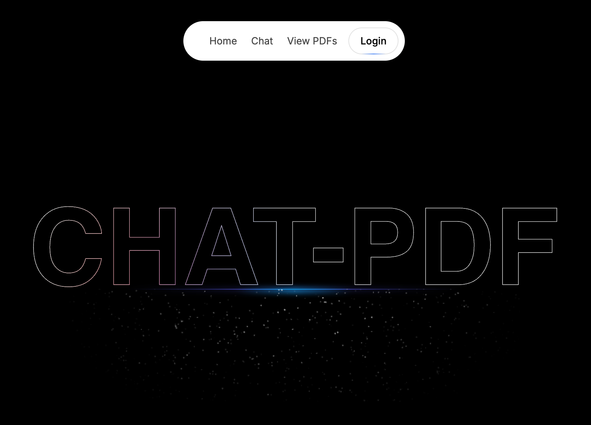

# Advanced Retrieval-Augmented Generation (RAG) for PDFs



## Tech Stack:

- Frontend: Next.js
- Backend: FastAPI, Pinecone, PostgreSQL
- AI-integration: Llamaindex, Langchain, HuggingFace

## Overview

This project demonstrates a complete pipeline for a Retrieval-Augmented Generation (RAG) system. The primary objective is to extract text data from PDF documents, semantically process and embed this data, and store it in Pinecone for efficient retrieval during query time. 

The pipeline uses Adobe PDF Services for extracting structured text from PDFs, applies semantic chunking with Hugging Face models, and stores the resulting vectors in Pinecone for scalable retrieval.

## Features

### 1. **PDF Text Extraction**
   - **Adobe PDF Services Integration**: This project integrates with Adobe PDF Services to handle the extraction of text and table data from PDF files. The process involves uploading the PDF document to Adobe's cloud-based service, which then processes the document and extracts structured data such as paragraphs, headers, and table contents.
   - **Handling of Complex PDF Structures (Currently unavailable)**: The extraction process is designed to manage complex document structures, including multi-column layouts, nested tables, and embedded images. The extracted content is returned as structured data, which is then processed further for text analysis and retrieval tasks.

### 2. **Text Chunking**
   - **Recursive Character Text Splitting**: The extracted text from the PDF is split into smaller, more manageable chunks using the RecursiveCharacterTextSplitter. This method splits text based on a hierarchy of separators (e.g., paragraphs, sentences, and words), which allows for flexible chunk sizes that can be tailored to specific downstream tasks like text embedding or semantic analysis.
   - **Customizable Chunk Size and Overlap**: The chunk size and overlap are configurable, allowing for fine-tuning of the text segmentation process. This flexibility ensures that the text chunks are optimally sized for the embedding model, balancing between too large (which might dilute semantic meaning) and too small (which might lose context).
   - **Efficient Handling of Large Texts**: The chunking process is designed to handle large documents efficiently, splitting the text in a way that preserves semantic coherence while maintaining manageable sizes for processing. This is especially important for documents that are several pages long or contain dense information.

### 3. **Semantic Node Parsing**
   - **Grouping Sentences Semantically**: Once the text is chunked, sentences are grouped into semantically related nodes using the `SemanticSplitterNodeParser`. This process involves generating embeddings for each sentence and grouping them based on their semantic similarity, which is determined by the cosine similarity of their embeddings.
   - **Buffering and Semantic Similarity Threshold**: The parser uses a buffer to consider surrounding sentences when evaluating semantic similarity. This buffer ensures that the context of each sentence is preserved, leading to more accurate semantic groupings. Additionally, a percentile threshold is applied to determine where to split the text into different nodes, allowing for fine control over the granularity of the semantic chunks.
   - **Metadata Inclusion**: Each node includes metadata that links it back to its source document, page number, and other relevant details. This metadata is crucial for tasks that require tracing information back to its original context, such as document retrieval or detailed text analysis.

### 4. **Embedding Storage**
   - **Hugging Face Model Integration**: The project uses a Hugging Face model, specifically `sentence-transformers/all-mpnet-base-v2`, to generate dense embeddings for the text nodes. These embeddings capture the semantic meaning of the text, making them suitable for a wide range of natural language processing tasks such as similarity search, clustering, and classification.
   - **Efficient Batch Processing**: Embeddings are generated in batches, leveraging multiprocessing to speed up the process. This is particularly important when dealing with large datasets or when embedding needs to be done on the fly for real-time applications.
   - **Semantic Embedding Association**: Each text node is paired with its corresponding embedding, ensuring that the semantic meaning of the text is preserved and can be leveraged during the retrieval process.

### 5. **Namespace-Based Upsertion**
   - **Dynamic Namespace Generation**: The project implements a dynamic namespace generation strategy within Pinecone. Each time text and embeddings are upserted into Pinecone, a unique UUID is generated to create a new namespace. This allows for easy segregation of different datasets or versions, making it simple to manage, update, and retrieve specific data sets without interference from others.
   - **Pinecone Index Management**: The project checks for the existence of the specified Pinecone index before attempting to create it, ensuring that duplicate indices are not created. This index management also includes setting the appropriate similarity metric (dot product or cosine similarity) based on the use case.
   - **Validation and Error Checking**: After upserting the data, the project validates the success of the operation by checking the vector count in the Pinecone index. This ensures that all vectors have been correctly stored and are available for retrieval, with appropriate error logging and handling if any issues are detected.


## Prerequisites

- Python 3.7 or higher
- Required libraries: `os`, `logging`, `json`, `uuid`, `warnings`, `io`, `zipfile`, `re`, `time`, `tqdm`, `dotenv`, `numpy`, `adobe.pdfservices`, `pinecone`, `langchain`, `llama_index`, `sentence-transformers`


## Installation Guide

1. Clone the repository:
   ```bash
   git clone https://github.com/mcxraider/chat-pdf.git
   ```
2. Install the required dependencies:
   ```bash
   pip install -r requirements.txt
   ```
3. Set up environment variables:
   - Create a `.env` file in the root directory.
   - Add the following keys:
     ```plaintext
     GROQ_API_KEY=your_groq_api_key
     HUGGINGFACE_API_KEY=your_huggingface_api_key
     PINECONE_API_KEY=your_pinecone_api_key
     OPENAI_API_KEY=your_openai_api_key
     ADOBE_SERVICES_CLIENT_ID=your_adobe_services_client_id
     ADOBE_SERVICES_CLIENT_SECRET=your_adobe_services_client_secret
     HF_API_URL=your_huggingface_api_url
     ```

